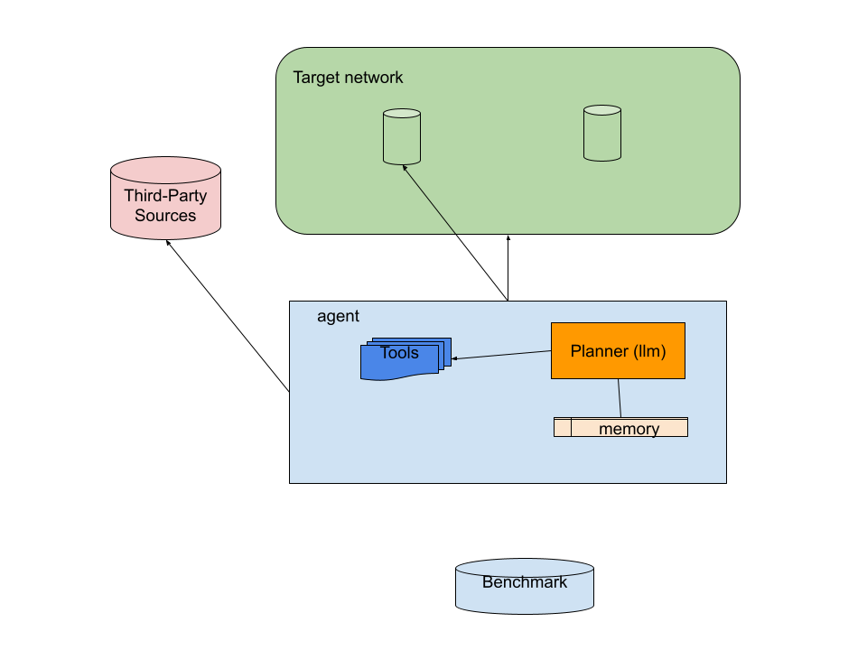
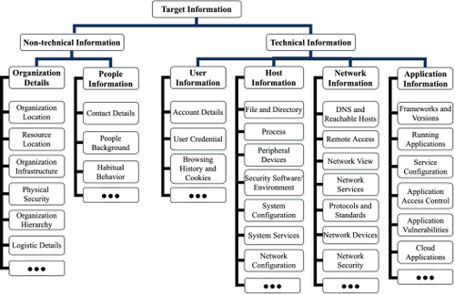
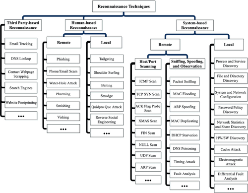
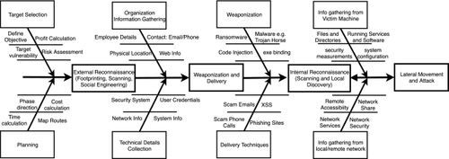

# Towards AI Agents for Comprehensive Reconnaissance (_draft_)

## Abstract

The growing complexity of cyber threats, combined with a persistent shortage of skilled cybersecurity professionals, has motivated interest in autonomous systems for penetration testing. Large Language Model (LLM)-based AI agents have shown promise in automating aspects of vulnerability discovery and exploitation, yet current systems often treat reconnaissance as a preliminary or tool-driven step rather than a sustained reasoning process. This paper proposes a **reconnaissance-centric multi-agent framework**, where a planner agent orchestrates specialized tool/technique expert agents to gather, interpret, and reason about information iteratively. By modeling *what* information to collect, *how* to obtain it, and *why* it matters, the framework addresses limitations in reasoning, phase-awareness, and adaptive strategy present in current AI agents. The proposed design enhances the realism, efficiency, and explainability of autonomous penetration testing, offering a foundation for both practical red teaming and research into adversarial behavior modeling.

## 1. Introduction

The cybersecurity industry is currently grappling with a severe labor shortage that has direct economic consequences for organizations worldwide. Despite growing demand for security assessments and proactive testing, there remains a substantial gap between available cybersecurity professionals and open positions. According to the 2025 (ISC)² Cybersecurity Workforce Study, the global cybersecurity workforce gap has reached approximately 4.8 million unfilled positions, and security teams across industries continue to report significant understaffing and skills shortages that hinder effective defense and assessment. These staffing challenges contribute to higher breach costs and longer remediation timelines, as organizations struggle to secure talent with the requisite expertise. [12]

At the same time, recent analysis of frontier artificial intelligence indicates that AI technologies are playing an increasingly significant role in shaping both cybersecurity offense and defense. The *Frontier AI’s Impact on the Cybersecurity Landscape* study highlights that while AI is widely adopted in attack contexts—enabling more automated information gathering, exploitation, and attack chain construction—its application in defensive settings like penetration testing remains nascent and constrained by current model limitations. Moreover, frontier AI capabilities already demonstrate advantages in reconnaissance and early attack stages, but defensive applications lag in workflow planning, domain tool usage, and adaptive reasoning.[2]

These combined pressures—rising costs due to labor scarcity and the rapid advancement of AI in offensive cybersecurity—have spurred interest in developing autonomous systems for security assessment. In particular, large language model (LLM)–based AI agents have been proposed as a means to automate components of penetration testing, including reconnaissance, vulnerability identification, and exploitation. Despite promising early results in limited domains, existing LLM-based agents still face significant challenges in modeling comprehensive reconnaissance, coordinating complex attack workflows, and adapting strategy in dynamic environments. This position paper argues that addressing these limitations requires rethinking how reconnaissance is conceptualized and integrated into AI-driven penetration testing agents.

The remainder of this paper is organized as follows. Section 2 introduces key concepts, including the Cyber Kill Chain, MITRE ATT&CK framework, reconnaissance, LLM-based AI agents, and prior work on AI-driven penetration testing. Section 3 analyzes the current limitations of reconnaissance in existing agents, highlighting gaps in reasoning, phase awareness, and multi-agent coordination. Section 4 presents the proposed reconnaissance-centric multi-agent framework, detailing the planner agent, tool/technique experts, reasoning module, phased reconnaissance process, and system architecture. Section 5 discusses the end goals and implications of the framework, including research insights, practical applications for automated red teaming, and contributions to defensive security. Finally, Section 6 outlines directions for future work, including benchmarking, prototype development, and further exploration of adaptive reconnaissance strategies.

---

## 2. Concepts
### 2.1 Cyber kill chain

The Cyber Kill Chain (CKC), originally proposed by Lockheed Martin, models cyber intrusions as a sequence of adversarial stages, typically including reconnaissance, weaponization, delivery, exploitation, installation, command and control, and actions on objectives [3]. This linear abstraction provides a useful high-level framework for understanding how attacks progress and where defensive controls may disrupt them. Complementing this perspective, the MITRE ATT&CK framework offers a more granular, empirically grounded taxonomy of adversary behavior, organizing observed techniques and procedures across tactical objectives such as reconnaissance, initial access, execution, persistence, and lateral movement. While CKC emphasizes attack progression, ATT&CK captures the diversity and non-linearity of real-world adversarial behavior. Together, these frameworks are widely used in both offensive and defensive security to reason about attacker capabilities, coverage gaps, and detection strategies, and they provide a conceptual foundation for designing and evaluating automated penetration testing systems.[4]

### 2.2 Reconnaissance as an Adversarial Process
Reconnaissance constitutes the foundational phase of both the Cyber Kill Chain and the MITRE ATT&CK framework, encompassing the systematic collection and interpretation of information about a target environment prior to exploitation. This phase includes activities such as identifying exposed assets, mapping network topology, discovering technologies and dependencies, and gathering contextual intelligence from third-party and open-source sources. Importantly, reconnaissance is not a passive or purely mechanical process; adversaries continuously make decisions about which information to seek, which techniques to apply, and how to adapt their strategy based on incomplete, noisy, or deceptive signals. Prior work characterizes reconnaissance as an iterative belief-forming process in which attackers refine hypotheses about system configurations and defensive posture over time. As such, effective reconnaissance requires not only tool execution but also prioritization, reasoning, and phase-aware adaptation—properties that are critical for realistic modeling of adversarial behavior and remain insufficiently represented in current LLM-based AI agents.[1]

### 2.3 LLM-Based AI Agents

LLM-based AI agents are commonly instantiated as **single-agent architectures**, where a single large language model is responsible for perception, planning, reasoning, and action execution within a closed control loop. In this design, the agent is typically augmented with external tools (e.g., scanners, shells, APIs), short-term or long-term memory, and a planner that translates high-level goals into executable steps. The LLM serves as the central decision-making component, interpreting observations, selecting actions, and updating internal state based on tool outputs. Single-agent designs are appealing due to their conceptual simplicity and lower coordination overhead, and they have been widely adopted in early LLM-based penetration testing systems. However, this architecture often conflates distinct cognitive functions—such as information gathering, hypothesis formation, and strategy adaptation—into a single reasoning process, making it difficult to model complex behaviors like iterative reconnaissance, uncertainty management, and phase-aware decision-making.

To address these limitations, recent work has explored **multi-agent architectures**, in which multiple specialized LLM-based agents collaborate toward a shared objective. In these systems, agents may be assigned distinct roles—such as planner, executor, analyst, or recon specialist—and interact through structured communication protocols. [10] Frameworks such as CrewAI and AutoGen exemplify this approach by enabling role-based coordination, message passing, and task decomposition among agents. Multi-agent designs better reflect the division of labor observed in human penetration testing teams and offer improved modularity and interpretability. Nevertheless, existing multi-agent penetration testing systems often allocate reconnaissance to a narrow, tool-driven role rather than modeling it as a sustained, belief-updating process. As a result, while multi-agent architectures improve scalability and organization, they do not inherently resolve the deeper challenges of comprehensive and adaptive reconnaissance highlighted in this paper.

### 2.4 AI Agents in Penetration Testing

Recent work has begun to explore the feasibility of using LLM-based autonomous systems to perform penetration testing tasks traditionally handled by skilled human practitioners. A key motivation in these efforts is to reduce the labor cost and expertise bottleneck inherent in manual testing by enabling an intelligent system to autonomously orchestrate scanning, exploitation, and reporting. For example, autonomous assumed-breach frameworks driven by large language models have demonstrated the ability to compromise accounts within realistic enterprise testbeds, adapting attack strategies dynamically and correcting procedural errors during execution. Such prototypes illustrate that an LLM agent can coordinate multi-step attack sequences, integrate tool outputs, and adjust actions based on feedback—suggesting that automation of complex red-team behavior is technically feasible, at least in constrained environments. [8]

Nevertheless, current AI agents in penetration testing exhibit significant shortfalls when evaluated against real-world complexity. Benchmarking studies and literature reviews highlighted in Frontier AI impact analyses show that existing systems struggle with flexible workflow planning, incorporation of domain-specific tools, and handling dynamic environments—capabilities that are essential for comprehensive security assessment. In many implementations, agents perform well on simplified benchmarks or isolated tasks such as service enumeration or exploit invocation, yet they falter when faced with integrated decision-making across varied reconnaissance, exploitation, and post-exploitation stages. These limitations reflect fundamental architectural and reasoning challenges: LLMs may hallucinate procedural steps, misinterpret tool outputs, or fail to maintain coherent multi-stage strategies without carefully designed scaffolding or external constraint structures. 

To bridge these gaps, recent research has explored structured enhancements to AI penetration testing agents. Approaches include modular benchmarks that decompose the pentesting workflow into distinct stages—such as information collection, weakness filtering, exploit decision-making, and execution—thereby enabling targeted evaluation and improvement of each component. Other work has proposed integrating guided reasoning pipelines, such as structured attack trees grounded in established frameworks like MITRE ATT&CK, to constrain and focus model reasoning toward productive actions. These developments indicate a trend toward more disciplined agent architectures that separate cognitive roles (e.g., planner, reasoner, executor) and more explicitly model the dependencies between reconnaissance and later stages of an assessment. Despite these advances, current state-of-the-art systems still offer limited situational awareness and adaptive planning compared to human experts, particularly in the context of reconnaissance and phased attack strategies—highlighting a core gap that this paper aims to address. [11]

---

## 3. Current Limitation of Reconnaissance in AI Agents

Despite rapid progress in LLM-based penetration testing agents, reconnaissance remains one of the least mature and least explicitly modeled components of these systems. Most contemporary agents adopt an end-to-end (E2E) framing in which reconnaissance is treated as an initial, lightweight step—often reduced to running a small set of predefined tools such as port scanners or directory enumerators. This design choice implicitly assumes that reconnaissance is a solved or easily automatable problem, when in practice it constitutes a substantial portion of human penetration testing effort. As a result, current agents tend to gather only surface-level information and fail to develop a comprehensive understanding of the target environment before transitioning to exploitation-oriented actions.

Existing AI agents also exhibit limited awareness of reconnaissance phases and contexts. Prior work distinguishes between external reconnaissance, which emphasizes third-party and open-source intelligence, and internal reconnaissance, which focuses on network topology, identity relationships, privilege boundaries, and system configuration after initial access. [1] Many agents blur or ignore this distinction, applying similar techniques regardless of attack stage or access level. Studies of autonomous penetration testing systems highlight these limitations: AutoAttacker focuses primarily on post-compromise actions, neglecting pre-compromise reconnaissance [7], while other assumed-breach agents demonstrate shallow reconnaissance capabilities when navigating enterprise networks [8]. This phase-agnostic behavior not only reduces realism but also undermines stealth, efficiency, and strategic planning.

Finally, even multi-agent penetration testing systems that include a nominal “reconnaissance agent” often fail to address these deeper modeling challenges. In most cases, the reconnaissance role is narrowly scoped to tool execution rather than sustained sense-making. There is little support for long-term memory of reconnaissance findings, cross-correlation of heterogeneous data sources, or explicit representation of attacker beliefs and assumptions. PentestAgent, for example, implements multi-agent orchestration but still treats reconnaissance as a limited task rather than a continuous reasoning process [9]. Addressing these limitations requires rethinking reconnaissance not as a subtask, but as a core organizing principle in the design of LLM-based AI agents for penetration testing.

---

## 4. Framework
  
*Figure 1: Key Components of the System*  

This section presents a **reconnaissance-centric AI agent framework** designed to overcome the conceptual and practical limitations of current LLM-based penetration testing agents. Unlike prior end-to-end approaches that treat reconnaissance as a transient preprocessing step, this framework elevates reconnaissance to the **core organizing principle** of agent behavior. The system is implemented as a **multi-agent architecture**, where a central **planner agent** orchestrates the reconnaissance process by assigning tasks, sequencing actions, and integrating findings. Individual agents serve as **tool and technique experts**, each specialized in specific reconnaissance methods such as network scanning, web application enumeration, open-source intelligence gathering, or social engineering. By explicitly separating planning, reasoning, and tool execution, the framework mirrors the structure of human penetration testing teams, enabling more adaptive, efficient, and realistic reconnaissance.

The framework is structured around three fundamental questions: **what** information should be gathered, **how** it should be obtained, and **why** it matters within the broader attack context. The planner agent is responsible for high-level strategy, including selecting which reconnaissance objectives to pursue and delegating tasks to specialized agents. Expert agents then carry out their assigned techniques, returning observations to the planner for integration and interpretation. This continuous feedback loop allows the system to refine hypotheses, manage uncertainty, and adapt its approach as new information becomes available.  

### 4.1 Information Gathered & Techniques

  
*Figure 2: Categories of target information for reconnaissance. taken from [1]*  
At the foundation of the framework is a formal representation of reconnaissance information types and the techniques used to acquire them. Information is categorized across dimensions such as asset discovery, technology identification, trust relationships, system configurations, and environmental context. Each category is linked to specific techniques, spanning passive intelligence collection, active probing, and hybrid methods.[1]

  
*Figure 3: Taxonomy of reconnaissance techniques. taken from [1]*

To support specialization, **individual agents are modeled as technique or tool experts**. Each expert agent maintains proficiency in a defined set of reconnaissance methods and tools, such as port scanners, web crawlers, or threat intelligence databases. The planner coordinates these experts, dynamically assigning tasks, combining complementary expertise, and ensuring that information collected across agents is synthesized into a coherent view of the target. [1]

### 4.2 Reasoning Module

The planner agent serves as the cognitive core of the multi-agent framework, using an LLM as a dedicated planning module to decompose high-level reconnaissance goals into sub-tasks, prioritize objectives, and sequence actions based on evolving observations. Unlike reactive agents, this approach explicitly separates reasoning from execution, enabling iterative plan refinement, hypothesis updating, and uncertainty management, as emphasized in recent surveys of LLM agent planning. [6] The planner delegates tasks to specialized tool/technique expert agents, integrates their observations, and continuously adjusts the reconnaissance strategy, mirroring reflection-based planning methods that improve multi-step task performance. By embedding structured planning within the agent, the framework supports long-horizon reasoning, adaptive prioritization, and realistic modeling of adversarial decision-making, addressing limitations of current end-to-end LLM-based penetration testing agents.

### 4.3 Phases of Reconnaissance
  
*Figure 4: External and internal reconnaissance. taken from [1]*  

The framework explicitly models reconnaissance as a **phased process**, distinguishing between external reconnaissance (focusing on open-source intelligence, third-party data, and passive observation) and internal reconnaissance (focusing on system topology, configuration, and privilege relationships after initial access). The planner adapts agent assignments and techniques based on the current phase, ensuring that the system applies the right methods at the right stage of engagement. This phase-aware design enhances both efficiency and realism. [1]

### 4.4 System Architecture

*Figure 5: Key Components of an Agent’s LLM Architecture. taken from [5]*  

From a systems perspective, the framework is decomposed into modular components: the **planner agent**, a **memory subsystem**, and a suite of **specialized tool/technique expert agents**. The planner orchestrates the overall process, maintains a global view of collected information, and updates hypotheses. The memory subsystem captures both short-term observations and long-term knowledge to support iterative reasoning and prevent redundant operations. Expert agents act on planner instructions, executing their assigned techniques and reporting findings in structured formats. This modular design promotes extensibility, interpretability, and targeted benchmarking, unlike monolithic end-to-end agent designs. [5]

### 4.5 Case Scenario:TBD

---

## 5. End Goal & Implications
The overarching goal of this work is to reposition **comprehensive reconnaissance** as a central research objective for autonomous penetration testing agents rather than a preliminary subroutine. Current LLM‑based agents often demonstrate promising end‑to‑end automation capabilities, yet they do not adequately capture the depth, sequencing, and strategic reasoning that characterize adversarial reconnaissance in practice. By structuring agents around **planner‑coordinated, specialized reconnaissance behaviors**, we enable systematic evaluation of *what* information is gathered, *how* it is acquired, and *why* it matters for downstream attack decisions. This approach draws inspiration from foundational taxonomies of adversarial reconnaissance, which emphasize detailed mapping of information needs and techniques across the attack lifecycle—and which existing game‑theoretic models still struggle to represent fully. [1]

From a research perspective, advancing adversarial reconnaissance models has significant implications for both offensive and defensive cybersecurity research. Existing surveys of reconnaissance methods highlight that attackers dynamically form and revise beliefs about target systems as new data arrives, yet LLM‑based agents lack explicit mechanisms for belief updating, uncertainty management, and phase‑aware strategy adaptation. By enabling agents to maintain structured memory of observations, reason about information value, and iteratively refine hypotheses, the proposed framework supports deeper empirical study of adaptive adversarial behavior. Moreover, structured reconnaissance agents provide a platform for evaluating how different mitigation techniques—such as deception and moving target defense—impact adversary information acquisition, a topic actively explored in the broader adversarial modeling literature. [2]

Practically, improving autonomous reconnaissance has the potential to transform automated red teaming and security assessment. Reconnaissance‑centric agents can identify nuanced exposure paths, generate representative adversarial traces, and highlight detection blind spots that simpler end‑to‑end agents miss. This enables more robust benchmarking of defensive controls and informs the design of countermeasure strategies that explicitly disrupt adversarial information gathering. Additionally, recon‑focused architectures—grounded in observable intermediate reasoning states—support explainability and auditability, which are crucial for organizations deploying AI security tools in operational contexts. In this way, elevating reconnaissance not only enhances agent effectiveness but also strengthens the scientific foundations and real‑world applicability of AI‑driven cybersecurity systems.

---

## 6. Future Work

This paper argues that reconnaissance remains an underexplored and under-modeled component of LLM-based penetration testing agents. By elevating reconnaissance to a first-class research problem, we can move beyond narrow end-to-end AI agent demonstrations toward more realistic, analyzable, and defensible AI-driven security systems.

Ongoing work, including continued research, prototype development, and benchmarking of agent capabilities, will be maintained at:
[https://github.com/voidtracesigma/voidtrace-recon](https://github.com/voidtracesigma/voidtrace-recon)

---

## References

[1] Roy, Shanto, et al. "Survey and taxonomy of adversarial reconnaissance techniques." ACM Computing Surveys 55.6 (2022): 1-38.  
[2] Potter, Yujin, et al. "Frontier AI's Impact on the Cybersecurity Landscape." arXiv preprint arXiv:2504.05408 (2025).  
[3] Microsoft. 2025. What Is the Cyber Kill Chain? https://www.microsoft.com/en-us/security/business/security-101/what-is-cyber-kill-chain  
[4] Al-Sada, Bader, Alireza Sadighian, and Gabriele Oligeri. "MITRE ATT&CK: State of the art and way forward." ACM Computing Surveys 57.1 (2024): 1-37.  
[5] Castrillo, Victor de Lamo, et al. "Fundamentals of Building Autonomous LLM Agents." arXiv preprint arXiv:2510.09244 (2025).  
[6] Huang, Xu, et al. "Understanding the planning of llm agents: A survey." arXiv preprint arXiv:2402.02716 (2024).  
[7] Xu, Jiacen, et al. "Autoattacker: A large language model guided system to implement automatic cyber-attacks." arXiv preprint arXiv:2403.01038 (2024).  
[8] Happe, Andreas, and Jürgen Cito. "Can llms hack enterprise networks? autonomous assumed breach penetration-testing active directory networks." ACM Transactions on Software Engineering and Methodology (2025).   
[9] Shen, Xiangmin, et al. "Pentestagent: Incorporating llm agents to automated penetration testing." Proceedings of the 20th ACM Asia Conference on Computer and Communications Security. 2025.  
[10] Sapkota, Ranjan, Konstantinos I. Roumeliotis, and Manoj Karkee. "Ai agents vs. agentic ai: A conceptual taxonomy, applications and challenges." Information Fusion (2025): 103599.   
[11] Yang, Ruozhao, et al. "PentestEval: Benchmarking LLM-based Penetration Testing with Modular and Stage-Level Design." arXiv preprint arXiv:2512.14233 (2025).  
[12]  https://hakia.com/news/cybersecurity-talent-crisis-2026/"4.8 Million Unfilled Cybersecurity Jobs: Inside the Global Talent Crisis | Hakia"
